# Proyecto II – Programación I · Sistema de Gestión de Proveedores

Aplicación de consola desarrollada en **Java** que administra la información de
tres entidades relacionadas —**Proveedor (Supplier)**, **Empresa (Enterprise)** y
**Pedido (Order)**— aplicando una **arquitectura por capas (n‑capas)**.

> **Autores:** Jesús Ruiz y Noah Padilla
> **Asignatura:** Programación I (60) · UPTC – Seccional Sogamoso
> **Entidad asignada:** Proveedor

---

## 1. Descripción

El proyecto cumple los requisitos de la guía:

1. **Entidad principal** `Supplier` con **6 atributos**.
2. **Entidad asociada** `Enterprise` con **5 atributos** (relación de *agregación*).
3. **Entidad por composición** `Order` con **5 atributos** (relación de *composición* dentro de `Supplier`).
4. **Diagrama UML** (ver sección 4).
5. **Menú CRUD** para cada una de las 3 entidades: crear, consultar todos,
   consultar por id, actualizar y eliminar.
6. **Pruebas unitarias** con JUnit 5.
7. **Versionado** con Git/GitHub.

Se tomó como **plantilla** el proyecto de
[ProjectManagementStudent (José Charris)](https://github.com/josecharrisdev/ProjectManagementStudent)
—reutilizando su patrón de capas, el `ResultDTO`, las validaciones por expresiones
regulares y la estructura de vistas/controladores— y como **base** el repositorio
[Proyecto-2-progra (Jesús Ruiz)](https://github.com/JesusRuizDeveloper/Proyecto-2-progra),
del cual se conservan las entidades del dominio del proveedor (que maneja las
colecciones como atributos) y la enumeración `ClientType`.

---

## 2. Arquitectura por capas

```
┌──────────────────────────────────────────────────────────────┐
│  UI  (ui)                                                      │
│   ├── Main                  → arranque de la aplicación        │
│   ├── view  (vista)         → MainView, SupplierView,          │
│   │                            EnterpriseView, OrderView       │
│   └── controller            → BaseController + 3 controladores │
├──────────────────────────────────────────────────────────────┤
│  DTO  (dto)                 → ResultDTO<T>                     │
├──────────────────────────────────────────────────────────────┤
│  SERVICE  (service)         → lógica de negocio                │
├──────────────────────────────────────────────────────────────┤
│  REPOSITORY  (repository)   → persistencia en memoria (Map)   │
├──────────────────────────────────────────────────────────────┤
│  DOMAIN  (domain) + ENUMS   → Supplier, Enterprise, Order,    │
│                                ClientType, RegexPattern        │
└──────────────────────────────────────────────────────────────┘
```

**Flujo de una operación:** `View → Controller → Service → Repository` y el
resultado regresa encapsulado en un `ResultDTO<T>`.

| Capa | Responsabilidad |
|------|-----------------|
| **Domain** | Modela las entidades del problema (atributos y relaciones). |
| **Enums** | `ClientType` (tipos de cliente) y `RegexPattern` (patrones de validación). |
| **Repository** | Guarda y recupera entidades (en memoria con `HashMap`). Sin lógica de negocio. |
| **Service** | Reglas de negocio: evita duplicados, fusiona datos en actualizaciones. |
| **DTO** | `ResultDTO<T>`: transporta éxito/mensaje/datos/errores entre capas. |
| **Controller** | Valida la entrada (regex y enums) y traduce texto → objetos de dominio. |
| **View** | Interacción por consola (menús, lectura y escritura). |

---

## 3. Estructura del proyecto

```
Proyecto-2-progra/
├── src/
│   └── co/edu/uptc/supplier/
│       ├── domain/        Supplier.java · Enterprise.java · Order.java
│       ├── enums/         ClientType.java · RegexPattern.java
│       ├── dto/           ResultDTO.java
│       ├── repository/    SupplierRepository.java · EnterpriseRepository.java · OrderRepository.java
│       ├── service/       SupplierService.java · EnterpriseService.java · OrderService.java
│       └── ui/
│           ├── Main.java
│           ├── controller/  BaseController.java · SupplierController.java
│           │                 EnterpriseController.java · OrderController.java
│           └── view/        MainView.java · SupplierView.java
│                             EnterpriseView.java · OrderView.java
├── test/
│   └── co/edu/uptc/supplier/
│       ├── service/       SupplierServiceTest.java · EnterpriseServiceTest.java · OrderServiceTest.java
│       └── ui/controller/ SupplierControllerTest.java
├── lib/                   junit-platform-console-standalone.jar
├── README.md
└── repaso.md
```

---

## 4. Diagrama de clases (UML)

```mermaid
classDiagram
    direction LR

    %% ====================== ENUMS ======================
    class ClientType {
        <<enumeration>>
        BIG_ENTERPRISE
        ENTERPRISE
        SMALL_BUSINESS_OWNER
        +isValid(String value) boolean$
    }

    class RegexPattern {
        <<enumeration>>
        INTEGER
        DECIMAL
        NAME
        ADDRESS
        BOOLEAN
        TEXT
        -String pattern
        +getPattern() String
        +matches(String value) boolean
    }

    %% ====================== DOMAIN ======================
    class Supplier {
        -int idSupplier
        -int age
        -String name
        -boolean isActive
        -float comission
        -Map~Integer, Order~ orders
        +getIdSupplier() int
        +setIdSupplier(int) void
        +getAge() int
        +setAge(int) void
        +getName() String
        +setName(String) void
        +isActive() boolean
        +setActive(boolean) void
        +getComission() float
        +setComission(float) void
        +getOrders() Map~Integer, Order~
        +setOrders(Map~Integer, Order~) void
        +toString() String
    }

    class Enterprise {
        -Map~Integer, Supplier~ suppliers
        -int idEnterprise
        -String name
        -String addres
        -int numberOrders
        +getSuppliers() Map~Integer, Supplier~
        +setSuppliers(Map~Integer, Supplier~) void
        +getIdEnterprise() int
        +setIdEnterprise(int) void
        +getName() String
        +setName(String) void
        +getAddres() String
        +setAddres(String) void
        +getNumberOrders() int
        +setNumberOrders(int) void
        +toString() String
    }

    class Order {
        -ClientType clientType
        -String nameClient
        -int idSupplier
        -String addressClient
        -String order
        +getClientType() ClientType
        +setClientType(ClientType) void
        +getNameClient() String
        +setNameClient(String) void
        +getIdSupplier() int
        +setIdSupplier(int) void
        +getAddressClient() String
        +setAddressClient(String) void
        +getOrder() String
        +setOrder(String) void
        +toString() String
    }

    %% ====================== DTO ======================
    class ResultDTO~T~ {
        -boolean successful
        -String message
        -T data
        -List~String~ listMessageError
        +isSuccessful() boolean
        +setSuccessful(boolean) void
        +getMessage() String
        +setMessage(String) void
        +getData() T
        +setData(T) void
        +getListMessageError() List~String~
        +setListMessageError(List~String~) void
        +addError(String) void
    }

    %% ====================== REPOSITORY ======================
    class SupplierRepository {
        -Map~Integer, Supplier~ mapSuppliers
        +addUpdateSupplier(Supplier) void
        +findById(int) Supplier
        +findAll() List~Supplier~
        +deleteById(int) boolean
        +existsById(int) boolean
    }

    class EnterpriseRepository {
        -Map~Integer, Enterprise~ mapEnterprises
        +addUpdateEnterprise(Enterprise) void
        +findById(int) Enterprise
        +findAll() List~Enterprise~
        +deleteById(int) boolean
        +existsById(int) boolean
    }

    class OrderRepository {
        -Map~Integer, Order~ mapOrders
        +addUpdateOrder(int, Order) void
        +findById(int) Order
        +findAll() List~Order~
        +deleteById(int) boolean
        +existsById(int) boolean
    }

    %% ====================== SERVICE ======================
    class SupplierService {
        -SupplierRepository repository
        +addSupplier(Supplier) boolean
        +findById(int) Supplier
        +findAll() List~Supplier~
        +updateSupplier(Supplier) boolean
        +deleteById(int) boolean
    }

    class EnterpriseService {
        -EnterpriseRepository repository
        +addEnterprise(Enterprise) boolean
        +findById(int) Enterprise
        +findAll() List~Enterprise~
        +updateEnterprise(Enterprise) boolean
        +deleteById(int) boolean
    }

    class OrderService {
        -OrderRepository repository
        +addOrder(int, Order) boolean
        +findById(int) Order
        +findAll() List~Order~
        +updateOrder(int, Order) boolean
        +deleteById(int) boolean
    }

    %% ====================== CONTROLLER ======================
    class BaseController {
        <<abstract>>
        #validateRequired(String, String, ResultDTO) boolean
        #validatePattern(RegexPattern, String, String, ResultDTO) boolean
    }

    class SupplierController {
        -SupplierService service
        +addSupplier(String, String, String, String, String) ResultDTO~Supplier~
        +listSuppliers() List~Supplier~
        +findById(String) ResultDTO~Supplier~
        +updateSupplier(String, String, String, String, String) ResultDTO~Supplier~
        +deleteSupplier(String) ResultDTO~Supplier~
    }

    class EnterpriseController {
        -EnterpriseService service
        +addEnterprise(String, String, String, String) ResultDTO~Enterprise~
        +listEnterprises() List~Enterprise~
        +findById(String) ResultDTO~Enterprise~
        +updateEnterprise(String, String, String, String) ResultDTO~Enterprise~
        +deleteEnterprise(String) ResultDTO~Enterprise~
    }

    class OrderController {
        -OrderService service
        +addOrder(String, String, String, String, String, String) ResultDTO~Order~
        +listOrders() List~Order~
        +findById(String) ResultDTO~Order~
        +updateOrder(String, String, String, String, String, String) ResultDTO~Order~
        +deleteOrder(String) ResultDTO~Order~
        -validateClientType(String, ResultDTO) boolean
    }

    %% ====================== VIEW ======================
    class Main {
        +main(String[])$ void
    }

    class MainView {
        -Scanner sc
        -SupplierView supplierView
        -EnterpriseView enterpriseView
        -OrderView orderView
        +runApp() void
    }

    class SupplierView {
        -Scanner scanner
        -SupplierController controller
        +menu() void
    }

    class EnterpriseView {
        -Scanner scanner
        -EnterpriseController controller
        +menu() void
    }

    class OrderView {
        -Scanner scanner
        -OrderController controller
        +menu() void
    }

    %% ====================== RELACIONES DE DOMINIO ======================
    Supplier "1" *-- "0..*" Order : composición (orders)
    Enterprise "1" o-- "0..*" Supplier : agregación (suppliers)
    Order ..> ClientType : usa

    %% ====================== RELACIONES ENTRE CAPAS ======================
    Main ..> MainView
    MainView *-- SupplierView
    MainView *-- EnterpriseView
    MainView *-- OrderView

    SupplierView --> SupplierController
    EnterpriseView --> EnterpriseController
    OrderView --> OrderController

    BaseController <|-- SupplierController
    BaseController <|-- EnterpriseController
    BaseController <|-- OrderController
    BaseController ..> RegexPattern
    BaseController ..> ResultDTO

    SupplierController --> SupplierService
    EnterpriseController --> EnterpriseService
    OrderController --> OrderService
    OrderController ..> ClientType

    SupplierService --> SupplierRepository
    EnterpriseService --> EnterpriseRepository
    OrderService --> OrderRepository

    SupplierRepository o-- Supplier
    EnterpriseRepository o-- Enterprise
    OrderRepository o-- Order

    SupplierController ..> ResultDTO
    EnterpriseController ..> ResultDTO
    OrderController ..> ResultDTO
```



### Relaciones clave

| Relación | Tipo | Significado |
|----------|------|-------------|
| `Supplier` → `Order` | **Composición** (`*--`) | Un proveedor contiene sus pedidos (`Map<Integer, Order>`). Los pedidos forman parte del proveedor. |
| `Enterprise` → `Supplier` | **Agregación** (`o--`) | Una empresa agrupa proveedores (`Map<Integer, Supplier>`), pero estos existen de forma independiente. |
| `Order` → `ClientType` | **Dependencia** (`..>`) | El pedido usa la enumeración para su tipo de cliente. |
| `*Controller` → `BaseController` | **Herencia** (`<|--`) | Los controladores heredan las validaciones comunes. |
| `*Controller` → `*Service` → `*Repository` | **Asociación** | Cadena de delegación entre capas. |

---

## 5. Cómo ejecutar

### Requisitos
- **JDK 22 o superior** (probado con JDK 25).
- Opcional: **Eclipse** (el proyecto incluye `.project` y `.classpath`).

### Opción A · Desde Eclipse
1. *File → Import → Existing Projects into Workspace*.
2. Seleccionar la carpeta del proyecto.
3. Ejecutar `co.edu.uptc.supplier.ui.Main` como *Java Application*.

### Opción B · Desde la terminal

```bash
# Compilar el código fuente
javac -encoding UTF-8 -d bin $(find src -name "*.java")

# Ejecutar la aplicación
java -cp bin co.edu.uptc.supplier.ui.Main
```

---

## 6. Pruebas unitarias

Se incluyen **21 pruebas** con **JUnit 5** que cubren los servicios y la
validación de los controladores.

```bash
# Compilar pruebas
javac -encoding UTF-8 -cp "bin;lib/junit-platform-console-standalone.jar" \
      -d bin-test $(find test -name "*.java")

# Ejecutar todas las pruebas
java -jar lib/junit-platform-console-standalone.jar execute \
      -cp "bin;bin-test" --scan-classpath
```

> En Linux/macOS reemplace `;` por `:` en el classpath.

Resultado esperado: **21 tests successful**.

---

## 7. Reglas de validación (expresiones regulares)

| Patrón | Regex | Se aplica a |
|--------|-------|-------------|
| `INTEGER` | `^\d+$` | ids, edad, número de pedidos |
| `DECIMAL` | `^\d+(\.\d+)?$` | comisión |
| `NAME` | `^[a-zA-ZÁÉÍÓÚáéíóúÑñ ]+$` | nombres |
| `ADDRESS` | `^[a-zA-Z0-9ÁÉÍÓÚáéíóúÑñ #.,°-]+$` | direcciones |
| `BOOLEAN` | `^(true\|false)$` | estado activo |
| `TEXT` | `^.+$` | descripción del pedido |

El tipo de cliente del pedido se valida contra los valores de la enumeración
`ClientType`.

---

## 8. Créditos

- **Plantilla base:** José Charris — *ProjectManagementStudent*.
- **Modelo de dominio (proveedor):** Jesús Ruiz — *Proyecto-2-progra*.
- **Desarrollo:** Jesús Ruiz y Noah Padilla.
